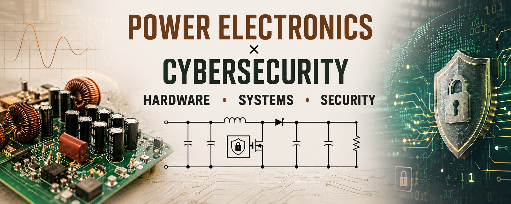

  

  

# Holy Rich

**Electronic & Computer Engineering Student \| Power Electronics ×
Cybersecurity**

I am building practical engineering competence at the intersection of
**power electronics, embedded systems, and cybersecurity**.

My focus is on understanding how real hardware works, how it is designed
and tested, and how connected and embedded systems can be made reliable
and secure.

## Areas of Focus

-   **Power Electronics**
    -   DC-DC converters and switch-mode power supplies
    -   MOSFETs, BJTs, gate driving, switching behavior
    -   Inductors, capacitors, rectifiers, filtering and protection
    -   Battery management systems and power conversion
    -   Inverters, motor drives, EMI/EMC and reliability
-   **Embedded & Hardware**
    -   Microcontrollers and digital systems
    -   Circuit design, simulation and PCB development
    -   Measurement, troubleshooting and fault analysis
    -   Hardware-software interaction
-   **Cybersecurity**
    -   Linux and networking fundamentals
    -   Network and system security
    -   Industrial Control Systems (ICS) / Operational Technology (OT)
        security
    -   Embedded and hardware security
    -   Security considerations for power and control systems

## Tools & Technologies

`Linux` · `SQL` · `Git` · `GitHub` · `Proteus` · `QSpice` · `Python` ·
`C/C++`

## What I'm Building

I am using simulation, theory, experiments and progressively more
practical hardware work to develop engineering projects such as:

-   Power converter designs and analyses
-   Embedded control of power-electronic systems
-   Battery and power-management systems
-   Motor-control and switching circuits
-   Security-focused experiments involving embedded and industrial
    systems

## Engineering Philosophy

> **Understand the circuit. Understand the system. Secure the system.**

I am particularly interested in the point where electrical hardware,
embedded control, industrial systems and cybersecurity meet.

## Currently Learning

**Power Electronics · Embedded Systems · Industrial/OT Security ·
Hardware Security · PCB Design · Switch-Mode Power Supplies**

## Connect

-   GitHub: [@rich-fav](https://github.com/rich-fav)

------------------------------------------------------------------------

*Learning in public. Building from fundamentals.*
